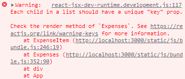

# 렌더링 리스트 및 조건부 Content

### 데이터의 렌더링 목록

- 데이터 목록을 동적으로 바꿔서 필터링이 가능하고, 새로운 아이템을 생성했을 때 목록에 추가할 수 있도록 해보자.

- 현재 App에서 Expenses로 expenses 배열을 props로 넘겨주고 있다.

- Expenses에서는 배열을 텍스트같은 형태로 출력하는 것이 아니라 배열의 요소별로 하나씩 expenses 아이템을 렌더링 하고자 한다.

- 자바스크립트 구문을 실행하기 위해 중괄호 안에 코드를 작성한다.

- 자바스크립트에 내장된 배열 메소드 map()을 사용한다.

- map: 다른 배열을 기반으로 새로운 배열을 생성하는데, 원본 배열에 있는 모든 요소들을 반환한다.

  - map 메소드를 호출해서 인자를 전달하는 함수를 취한다.
  - 함수가 실행되면 배열에 있는 모든 아이템에 map을 호출한다.
  - 함수의 결과값은 새로운 배열로 반환된다.

- ```react
  {props.items.map(expense => <ExpenseItem title={expense.title} amount={expense.amount} date={expense.date} />)}
  ```

- 

  - 이러한 경고문이 뜨지만 일단 넘어간다.

- 이제 모든 아이템들이 동적으로 렌더링된다.

### State 저장 목록 사용

- 새로운 expense가 추가될 때마다 expenses 배열을 업데이트 해보자.

- 지난 섹션에서 만든 addExpenseHandler 함수가 새로 추가된 아이템을 갖고 있으므로 이 expense를 expenses 배열에 추가하면 된다.

- ```react
  const [expenses, setExpenses] = useState(DUMMY_EXPENSES)
  
  const addExpenseHandler = (expense) => {
      setExpenses(prevExpenses => {
          return [expense, ...prevExpenses]
      })
  }
  ```

### keys

- Key 경고문에 대해 살펴보자.

- 개발자 도구를 열고 아이템을 추가하면 아이템리스트의 맨 마지막 div가 깜빡거리는 것을 볼 수 있다.

- 하지만 새로 추가한 목록은 맨 위에 위치하게 된다.

- 리액트는 새 아이템을 추가했을 때 div목록에 있는 마지막 아이템으로 렌더링하고 모든 아이템을 업데이트해서 컨텐츠를 교체한다. 하지만,,

  - 이러한 단계는 효율적이지 못하다.
  - 상태 유지 아이템이라면 새 아이템이 기존 아이템을 덮어쓰는 과정에서 버그를 만들 수도 있다.

- 리액트가 이렇게 작동되는 이유는 각각의 아이템들을 모두 비슷하다고 생각하기 때문에 새로운 아이템이 어느 위치에 추가되어야 하는지 모르기 때문이다.

- 새로운 아이템이 어디에 추가되어야 하는지 리액트에게 알려주어야 한다.

- map 메소드 안의 아이템에 key props를 추가하고 값은 expense.id를 할당한다.

  - ```react
    {props.items.map(expense => <ExpenseItem key={expense.id} title={expense.title} amount={expense.amount} date={expense.date} />)}
    ```

- 만약 고유 id가 없다면 map의 두번째 인자를 추가하여 map에서 자동으로 얻어지는 index를 사용하는 방법이 있다.

  - 하지만 이러한 방법 또한 버그가 발생할 수 있다.
    - 아이템 컨텐츠에 직접 첨부된 id가 아니고, 특정한 아이템에 대한 인덱스가 항상 똑같기 때문

- key를 추가했다면 더이상 오류가 뜨지 않고, 새로운 아이템을 추가했을 때 개발자도구를 보면 시작부분에 div가 새로 추가되는 것을 볼 수 있다.

> 연습하기: List 다루기

- 지난번에 만든 연도 필터을 이용하여 선택한 연도에 따른 expenses들만 보이도록 해보자.

  - filter 메소드로 배열을 필터링

- ```react
  const Expenses = (props) => {
    const [filteredYear, setFilteredYear] = useState('2020')
    const filterChangeHandler = (selectedYear) => {
      setFilteredYear(selectedYear)
    }
    const filteredExpenses = props.items.filter(expense => expense.date.getFullYear().toString() === filteredYear)
    return (
      <div>
        <Card className="expenses">
          <ExpensesFilter selected={filteredYear} onChangeFilter={filterChangeHandler} />
          {filteredExpenses.map(expense => <ExpenseItem key={expense.id} title={expense.title} amount={expense.amount} date={expense.date} />)}
        </Card>
      </div>
    );
  }
  ```

### 조건부 내용 출력하기

- 조건부 컨텐츠

  - 각각 다른 상황에서 다양한 출력값을 렌더링하는 것

- 연도에 따른 내용이 없는 경우에 아이템이 없다는 적절한 문구가 보여지게 하자.

- JSX 코드에 동적인 표현식을 추가하고 조건을 사용한다.

  - 여기서 중괄호를 사용하여 if문이나 for문을 사용할 수 없다.
  - 삼항 또는 조건부 표현식을 사용할 수 있다.

- 자바스크립트의 기본 조건부 표현식

  - `{condition(조건문)? exprIfTrue(참일 때 실행할 식) : exprIfFalse(거짓일 때 실행할 식)}`

- filteredExpenses의 길이가 0인지 조건문으로 체크한 후, true일 때는 아이템이 없다는 구문을, false일 때는 이전에 작성했던 아이템 목록을 출력하는 코드를 넣는다.

  - ```react
    {filteredExpenses.length === 0 ? (
        <p>No expenses found</p>
    ) : (
        filteredExpenses.map((expense) => (
            <ExpenseItem key={expense.id} title={expense.title} amount={expense.amount} date={expense.date} />
        ))
    )}
    ```

- 긴 조건부 표현식이 읽기 어렵기 때문에 자바스크립트에 있는 요령을 사용하여 조정해보자.

- 앤드 연산자(&)를 추가하고 조건을 만족했을 때 렌더링하고 싶은 JSX 콘텐츠를 넣는다.

  - &&(논리곱) 연산자의 단축 평가

  - ```react
    {filteredExpenses.length === 0 && <p>No expenses found</p>}
    ```

  - 첫 번째 조건에 만족했다면 앤드 연산자 다음으로 이동하여 그 값을 반환한다.

  - 그리고 0보다 크다면 아이템들을 반환한다.

  - ```react
    {filteredExpenses.length > 0 &&
        filteredExpenses.map((expense) => (
        <ExpenseItem key={expense.id} title={expense.title} amount={expense.amount} date={expense.date} />
    ))}
    ```

- 변수를 추가하는 방법

  - expensesContent이라는 변수를 만들어서 아이템이 없을 때 출력할 구문을 미리 넣어놓는다.

  - 이 방법을 쓰는 이유는 return 위 자바스크립트 코드에서 if문을 사용할 수 있어 깔끔한 JSX 로직을 구현할 수 있다.

  - ```react
    let expensesContent = <p>No expenses found</p>
    if (filteredExpenses.length > 0) {
      expensesContent = filteredExpenses.map((expense) => (
        <ExpenseItem key={expense.id} title={expense.title} amount={expense.amount} date={expense.date} />
      ))
    }
    ```

> 연습하기: 조건부 내용

- 현재 입력 폼이 항상 보여지는 것으로 되어있는데, 처음 화면에서는 폼 대신 버튼만 있고, 버튼을 누르면 폼이 보이도록 수정해보자.

- 폼에서 취소 버튼을 누르면 폼이 전송이 되지 않고 폼 작성이 취소되고 버튼만 보이도록 해보자.

- ```react
  const NewExpense = (props) => {
    const [isEditing, setIsEditing] = useState(false)
    const saveExpenseDataHandler = (enteredExpenseData) => {
      const expenseData = {
        ...enteredExpenseData,
        id: Math.random().toString()
      }
      props.onAddExpense(expenseData)
      setIsEditing(false)
    }
    const startEditingHandler = () => {
      setIsEditing(true)
    }
    const stopEditingHandler = () => {
      setIsEditing(false)
    }
  
    return <div className="new-expense">
      {!isEditing && <button onClick={startEditingHandler}>Add New Expense</button>}
      {isEditing && <ExpenseForm onSaveExpenseData={saveExpenseDataHandler} onCancel={stopEditingHandler} />}
    </div>
  }

- ```react
  <button type="button" onClick={props.onCancel}>Cancel</button>
  ```
